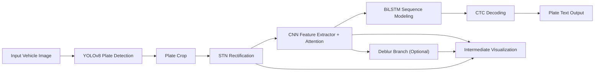

# End-to-End License Plate Recognition

本科毕业设计项目，一个面向中文车牌场景的端到端识别系统。项目目标不是只做单点识别，而是把 `检测 -> 校正 -> 特征提取 -> 序列识别 -> 可视化展示 -> 训练与恢复` 串成一条完整链路。

这个仓库更适合作为一份能力证明来看：

- 我可以把一个较大的视觉任务拆成多个可实现模块，并最终整合成可运行系统。
- 我不仅调用现成模型，也补上了训练脚本、推理流程、GUI 展示、日志与中间结果可视化。
- 在公开资料与 LLM 辅助条件下，我完成了方案推进、代码落地、实验组织和结果整理。
- 这个项目离工业落地还有距离，但已经体现出我在 `问题拆解`、`系统整合`、`实验推进`、`工程实现` 这几个方向的基础能力。

如果你是面试官、带教工程师或未来团队负责人，这个项目最值得看的不是“是否完全工业化”，而是我是否已经具备继续培养的基础。我认为答案是肯定的。

## Project Positioning

这是一个面向中国车牌识别场景的视觉系统，核心任务包括：

- 使用 `YOLOv8` 做车牌区域检测
- 使用 `STN + Attention + Deblur + CRNN` 做字符级识别
- 使用 `tkinter` 提供可视化桌面界面
- 使用渐进式训练策略组织识别模型训练
- 支持训练暂停、恢复、日志记录和评估结果输出

对本科阶段来说，这不是一个“只跑通 demo”的项目，而是一次完整的系统构建练习。

## What I Actually Built

### 1. Detection

- 基于 `YOLOv8` 微调车牌检测模型
- 保留了训练输出、指标曲线、混淆矩阵和导出 ONNX 的脚本
- 检测模型结果文件位于 `runs/detect/train/`

当前仓库中保留的检测训练结果显示：

- `mAP50 = 0.9940`
- `mAP50-95 = 0.7737`

这些结果来自仓库内已有的训练记录 `runs/detect/train/results.csv`。

### 2. Recognition

识别模型不是简单 CRNN 直连，而是做了增强设计：

- `STN`：对输入车牌进行几何校正
- `Attention`：增强关键区域特征
- `Deblur Module`：对模糊车牌场景做辅助恢复
- `CNN + BiLSTM + CTC`：完成字符序列建模和解码

项目中的 `xunlianzonghe.py` 提供了完整训练过程，而不只是推理代码。

### 3. End-to-End Integration

我把检测与识别真正串联起来了：

- 输入整张车辆图像
- 先检测车牌位置
- 再裁剪并送入识别网络
- 输出最终车牌号码
- 同时展示中间处理结果，方便分析与答辩演示

### 4. Visualization and Demo

项目提供桌面 GUI，可直接展示：

- 原始图像与检测框
- 裁剪后的车牌区域
- 最终识别文本
- STN 校正结果
- 去模糊结果
- 特征图与中间处理过程

这使得项目不仅“能跑”，也“能讲”，适合技术展示和面试交流。

## Why This Project Has Hiring Value

如果把这个仓库当作求职作品，我希望它体现的是下面几件事：

- 我不是只会问模型要代码，我能把一个目标拆成若干技术模块并组织起来。
- 我具备基础的深度学习实验意识，包括训练、验证、日志、可视化、模型保存与恢复。
- 我知道一个项目不仅要有模型，还要有推理入口、演示方式和结果解释能力。
- 我能在资源有限、经验有限的情况下推进复杂任务，并把它收敛成一个完整结果。

它还不代表我已经具备成熟的工业化交付能力，但足以说明我值得被放到 AI 应用、视觉工程、Agent 工程或初级算法/研发岗位中继续培养。

## System Architecture



## Training Design

识别模型训练采用渐进式策略，而不是一次性把所有模块堆进去：

1. `Stage 1`: 基础 CRNN 训练
2. `Stage 2`: 加入 STN
3. `Stage 3`: 加入去模糊分支
4. `Stage 4`: 联合微调

同时支持：

- `--resume` 训练恢复
- `--stage` 指定阶段启动
- `--max-train-time` 限制训练时长
- 日志输出与 TensorBoard 记录

这部分体现的是我的实验组织能力，而不只是网络搭建。

## Repository Structure

- `zhongduan.py`: 推理程序与 GUI 界面
- `xunlianzonghe.py`: 识别模型训练脚本
- `xunlianres2.py`: YOLOv8 检测训练脚本
- `models/`: 推理所需模型与字符映射
- `runs/`: 检测训练结果和可视化产物
- `requirements.txt`: Python 依赖

## Quick Start

建议使用 Python 3.10+。

```bash
python -m venv venv
venv\Scripts\activate
pip install -r requirements.txt
python zhongduan.py
```

推理所需文件：

- `models/best.pt`
- `models/final_model.pth`
- `models/chars_mapping.json`

## What Can Be Improved

我希望这份 README 既展示能力，也保留真实边界。这个项目目前仍有明显可改进点：

- 部分训练路径仍是本地绝对路径，复现体验可以继续优化
- 当前仓库更偏研究/毕设风格，距离生产级工程规范还有差距
- 识别阶段的统一 benchmark 展示还可以做得更完整
- 部署、接口化、自动化测试、配置管理还不够成熟

这些问题我不回避。相反，它们正好说明了我下一步要补的，是工程化与产品化能力，而不是重新证明“我能不能从 0 做出一个完整 AI 项目”。

## Suitable Review Perspective

如果你想快速判断这个项目是否值得继续看，可以重点看下面几件事：

- 是否真的完成了从检测到识别的系统串联
- 是否具备独立训练与实验组织意识
- 是否有清晰的模块划分和中间结果解释能力
- 是否能把模型能力转化为可展示、可操作的完整程序

如果你的结论是“基础还不算强，但具备潜力，值得给机会继续成长”，那么这个项目已经达到了它作为毕业设计和求职作品的目的。

## Notes

- 本项目面向学习、研究和毕业设计展示，不直接等同于工业级方案。
- 仓库中保留了一部分训练产物，便于查看实验结果和项目完成度。
- 后续如果继续迭代，我会优先补齐配置化、复现性、评估报告和部署能力。
