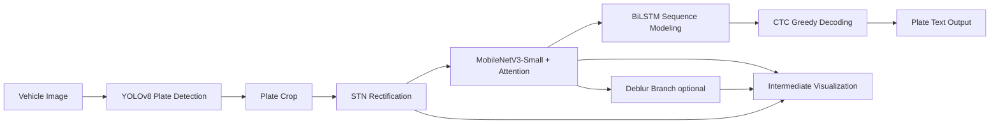
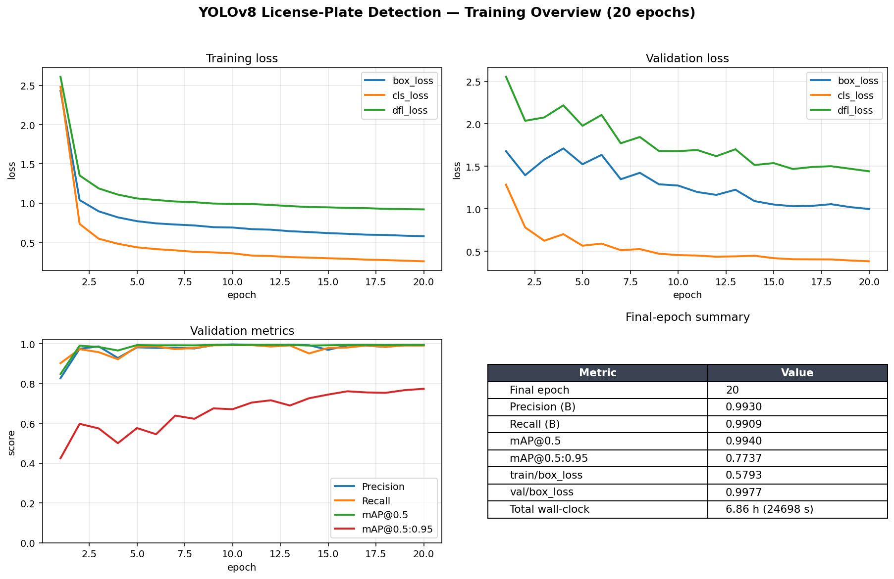
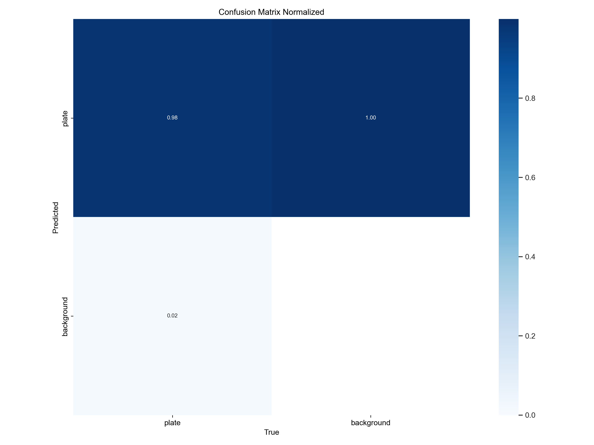
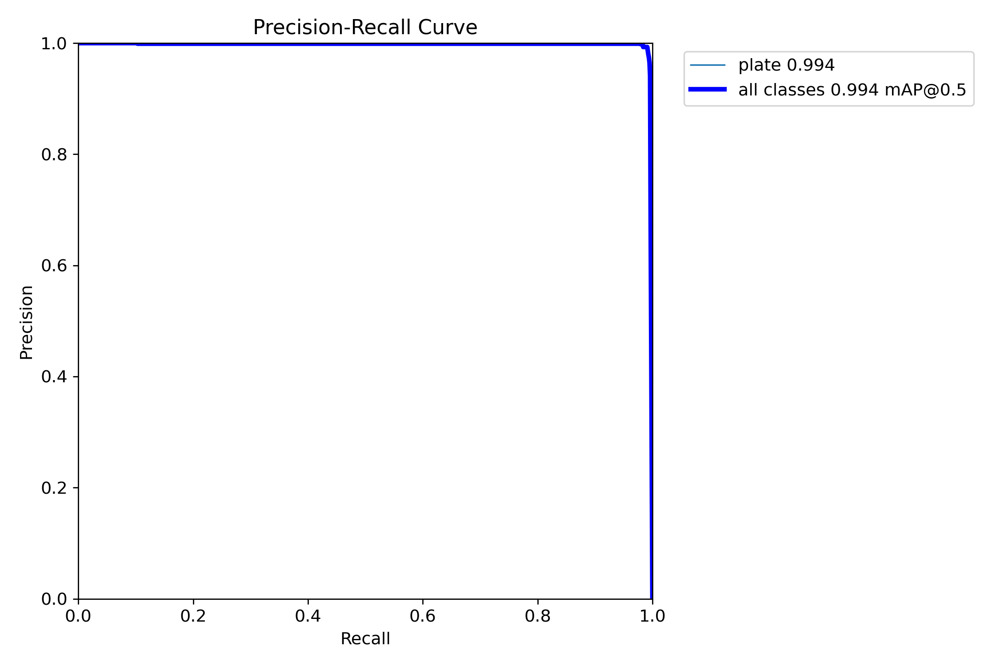

# 端到端中文车牌识别系统 (End-to-End Chinese License Plate Recognition)

[](https://www.python.org/)
[](https://pytorch.org/)
[](LICENSE)
[](https://github.com/ultralytics/ultralytics)
[](#环境与依赖)

> 本科毕业设计开源版本 · 面向中文车牌场景的两阶段识别系统
>
> `YOLOv8 检测` + `STN + MobileNetV3 + Attention + Deblur + BiLSTM + CTC` 识别 + `Tkinter` 可视化 GUI
>
> English version: see [README_EN.md](README_EN.md).

本仓库实现了一个从单张车辆图像到最终车牌字符串的完整识别链路，并附带训练脚本、训练产物（含 PR / F1 / 混淆矩阵）、可视化 GUI 与渐进式训练框架。

项目目标不是"再造一个工业级车牌识别系统"，而是把检测、几何校正、特征提取、去模糊辅助任务、序列建模、CTC 解码、GUI 演示与训练工程串成一条可独立运行的链路，作为本科阶段的完整系统设计与实现练习开放出来。

---

## 目录

- [系统架构](#系统架构)
- [主要特性](#主要特性)
- [仓库结构](#仓库结构)
- [环境与依赖](#环境与依赖)
- [快速开始（推理 / GUI）](#快速开始推理--gui)
- [训练流程](#训练流程)
- [训练产物与已验证指标](#训练产物与已验证指标)
- [实现细节](#实现细节)
- [已知问题与待改进](#已知问题与待改进)
- [Roadmap](#roadmap)
- [致谢与引用](#致谢与引用)
- [License](#license)

---

## 系统架构



链路上每一个中间结果（检测框、裁剪后的车牌、STN 仿射校正后的图像、去模糊分支输出、特征图）都会在 GUI 上显示，便于讲解与调试。

> 📊 训练曲线总览见 [训练产物与已验证指标](#训练产物与已验证指标)。
> 📷 GUI 运行截图与流程示意图占位于 [`docs/screenshots/`](docs/screenshots/)，
>    需要本地跑一遍 `python zhongduan.py` 后自行截图补入（避免泄露真实车牌）。

---

## 主要特性

- **两阶段识别**：YOLOv8 负责定位，自定义增强 CRNN 负责字符序列识别。
- **几何校正**：STN（Spatial Transformer Network）输出 2×3 仿射矩阵，缓解倾斜、透视形变。
- **注意力增强**：通道注意力 + 空间注意力（CBAM 风格）叠加在主干特征图上。
- **去模糊辅助分支**：以重建原图为辅助任务，引导特征对模糊场景更鲁棒。
- **轻量主干**：默认使用 `MobileNetV3-Small` 前 5 个 block 作为特征提取器（也可一键切换到 ResNet18）。
- **CTC 序列识别**：BiLSTM (hidden=256, 双向) + CTC，无需字符级标注。
- **渐进式分阶段训练**：先 CRNN，再加 STN，再加去模糊，最后联合微调，避免一次性堆叠模块导致训练不稳。
- **训练工程化**：检查点 / `--resume` / `--stage` / `--max-train-time` / 暂停文件触发的安全停止、TensorBoard、字符映射 JSON 持久化、详细 logging。
- **多种数据增强**：运动模糊、随机遮挡、高斯噪声、光照变化、雨滴模拟、轻量弹性形变。
- **GUI 演示**：基于 tkinter，加载图像 → 一键检测识别 → 弹出中间结果可视化窗口。

---

## 仓库结构

```
end-to-end/
├── README.md                # 本文档（中文）
├── README_EN.md             # 英文版 README
├── LICENSE                  # MIT 许可（含第三方上游许可提示）
├── requirements.txt         # Python 依赖（已用 ~= / >= 软锁主版本）
├── CITATION.cff             # GitHub「Cite this repository」元数据
├── .gitignore
├── .gitattributes           # 统一 LF 行尾、二进制类型标注
│
├── zhongduan.py             # 推理 + Tkinter GUI 程序（可直接运行）
├── xunlianzonghe.py         # 识别模型训练（4 阶段渐进式）
├── xunlianres2.py           # YOLOv8 检测训练（含 ONNX 导出）
│
├── models/                  # ★ 推理时实际加载的权重与字符映射
│   ├── best.pt              #   YOLOv8 检测权重（推理用）
│   ├── best.onnx            #   YOLOv8 ONNX 导出（推理用）
│   ├── final_model.pth      #   识别模型权重（EnhancedCRNN）
│   └── chars_mapping.json   #   字符 ↔ 索引映射
│
├── samples/                 # 演示用的示例图片目录（默认不内置图片，见目录内 README）
│   └── README.md
│
├── docs/screenshots/        # 项目截图 / 流程示意图（待补，见目录内 README）
│   └── README.md
│
└── runs/
    └── detect/train/        # ★ 留作训练证据的 YOLOv8 训练产物
        ├── args.yaml        #   实际训练超参
        ├── results.csv      #   每个 epoch 的 loss / 指标
        ├── results.png
        ├── PR_curve.png / F1_curve.png / P_curve.png / R_curve.png
        ├── confusion_matrix.png / confusion_matrix_normalized.png
        ├── labels.jpg / labels_correlogram.jpg
        ├── train_batch*.jpg / val_batch*_pred.jpg / val_batch*_labels.jpg
        └── weights/
            ├── best.pt      #   该次训练的最佳权重（与 models/best.pt 是不同次训练）
            └── best.onnx
```

### `models/` 与 `runs/detect/train/weights/` 的区别

仓库里有两个 `best.pt`，作用完全不同，不是冗余：

| 路径 | 角色 | 谁会读它 |
|---|---|---|
| `models/best.pt` / `best.onnx` / `final_model.pth` | **推理时实际加载的权重** | `zhongduan.py` GUI |
| `runs/detect/train/weights/best.pt` / `best.onnx` | **作为训练完成度证据保留的产物**，与 `results.csv`、各类曲线 PNG、混淆矩阵一起形成可复核的训练快照 | 仅供读者查看，不参与运行 |

如果你只想跑 GUI，只需要 `models/` 目录下的四个文件；`runs/` 整个目录都可以删。

---

## 环境与依赖

建议使用 **Python 3.10+** 与一块支持 CUDA 的 NVIDIA GPU；CPU 可推理但训练不现实。

```bash
python -m venv venv
# Windows
venv\Scripts\activate
# Linux / macOS
source venv/bin/activate

pip install -r requirements.txt
```

`requirements.txt` 当前未锁定版本。本项目在如下组合下实测可运行（仅供参考，并非强制）：

- torch 2.x + CUDA 11.8/12.x
- torchvision 与 torch 同版本
- ultralytics ≥ 8.1
- opencv-python、Pillow、scikit-image、tqdm、tensorboard、matplotlib、numpy、pyyaml

---

## 快速开始（推理 / GUI）

最低运行需求：`models/` 目录下四件套齐全。

```
models/
├── best.pt               # YOLOv8 检测模型
├── best.onnx             # YOLOv8 ONNX（可选）
├── final_model.pth       # 识别模型 (EnhancedCRNN)
└── chars_mapping.json    # 字符映射
```

启动 GUI：

```bash
python zhongduan.py
```

界面操作：

1. 点击 **加载图像**，选择一张包含车辆 / 车牌的图片（可以放到 `samples/` 下方便取用）。
2. 点击 **识别车牌**：
   - 左侧画布会显示带检测框的原图；
   - 右侧画布会显示裁剪后的车牌区域；
   - 主窗口下方显示识别结果字符串；
   - 同时弹出 matplotlib 中间结果窗（原始车牌、STN 校正、去模糊重建、特征图）。

> 说明：当前仓库中只发布了 GUI 入口；如需批量推理或脚本化调用，请见 [Roadmap](#roadmap)。

---

## 训练流程

> ℹ️ **路径配置方式**：训练脚本里的数据集路径、输出目录默认仍指向作者本机（`E:\CCPD2019`、`E:\BLPD`、`C:\Users\32044\Desktop\xunlianrcnn` 等）作占位，第三方使用时**通过下表的环境变量覆盖**即可，**不必再改源码**。

### 1. 数据集

本项目使用了两个公开数据集：

- **CCPD2019 / CCPD2020**：中科大开源的中文车牌大规模数据集，文件名即标签。仓库提供了 `parse_ccpd_filename` 解析函数。
- **BLPD**：以 `train.txt / val.txt` 形式给出 `image_name plate_number` 的中文车牌数据集。

数据集请自行从原始发布渠道获取，不在本仓库内分发。

### 2. 环境变量（覆盖默认路径）

| 环境变量 | 作用 | 适用脚本 |
|---|---|---|
| `YOLO_DATASET_PATH` | YOLO 格式数据集根目录（含 `data.yaml`） | `xunlianres2.py` |
| `YOLO_INIT_WEIGHTS` | YOLOv8 训练的起始权重（如 `yolov8n.pt`） | `xunlianres2.py` |
| `YOLO_TRAIN_PROJECT` | YOLOv8 训练输出目录（Ultralytics `project=`） | `xunlianres2.py` |
| `BLPD_DIR` | BLPD 数据集根目录 | `xunlianzonghe.py` |
| `BLPD_TRAIN_TXT` | BLPD train 列表，默认 `$BLPD_DIR/train.txt` | `xunlianzonghe.py` |
| `BLPD_VAL_TXT` | BLPD val 列表，默认 `$BLPD_DIR/val.txt` | `xunlianzonghe.py` |
| `CCPD_BASE_DIR` | CCPD2019 根目录（脚本内自动拼 `blur/weather/tilt`） | `xunlianzonghe.py` |
| `YOLO_MODEL_PATH` | 上一阶段训练完成的 YOLOv8 权重，用于裁车牌 | `xunlianzonghe.py` |
| `OUTPUT_DIR` | 训练产物 / 日志 / 检查点的输出目录 | `xunlianzonghe.py` |

不设置时使用脚本里写死的默认值。

### 3. 训练 YOLOv8 检测器

```bash
# Windows PowerShell
$env:YOLO_DATASET_PATH = "D:\datasets\CCPD2019\yolo_dataset"
$env:YOLO_INIT_WEIGHTS = "D:\weights\yolov8n.pt"
$env:YOLO_TRAIN_PROJECT = "D:\runs\plate_detect"
python xunlianres2.py

# Linux / macOS
YOLO_DATASET_PATH=/data/CCPD2019/yolo_dataset \
YOLO_INIT_WEIGHTS=/weights/yolov8n.pt \
YOLO_TRAIN_PROJECT=/runs/plate_detect \
python xunlianres2.py
```

脚本会训练、验证、并自动导出 ONNX。

### 4. 训练识别模型（渐进式 4 阶段）

```bash
# Windows PowerShell
$env:BLPD_DIR = "D:\datasets\BLPD"
$env:CCPD_BASE_DIR = "D:\datasets\CCPD2019"
$env:YOLO_MODEL_PATH = "D:\runs\plate_detect\exp\weights\best.pt"
$env:OUTPUT_DIR = "D:\runs\plate_recog"
python xunlianzonghe.py

# Linux / macOS
BLPD_DIR=/data/BLPD CCPD_BASE_DIR=/data/CCPD2019 \
YOLO_MODEL_PATH=/runs/plate_detect/exp/weights/best.pt \
OUTPUT_DIR=/runs/plate_recog \
python xunlianzonghe.py
```

支持的命令行参数：

```bash
# 仅从某阶段开始
python xunlianzonghe.py --stage 3

# 从最近的检查点恢复
python xunlianzonghe.py --resume

# 限制最长训练时间（分钟）
python xunlianzonghe.py --max-train-time 480

# 设定每天自动暂停时间，避免占机
python xunlianzonghe.py --pause-time 23:00
```

也可以通过创建 `pause_training.txt` 文件来在下一个 epoch 边界安全暂停：

```bash
# Windows
type nul > pause_training.txt
```

阶段划分：

| Stage | Epoch 数 | 启用模块 |
|:-:|:-:|:--|
| 1 | 15 | 基础 CRNN（无 STN / 无去模糊） |
| 2 | 10 | + STN |
| 3 | 10 | + 去模糊辅助任务（多任务损失） |
| 4 | 10 | 全模块联合微调 |

输出物（写入 `OUTPUT_DIR`，不进仓库）：

- `stageX_best_model.pth`：每阶段最佳权重
- `stageX_checkpoint_epoch_K.pth`：训练中断恢复用
- `chars_mapping.json`：字符映射，推理需要
- `logs/`：TensorBoard 日志
- `end_to_end_lpr.log`：训练日志

发布时需要把最终的 `chars_mapping.json` 和一个收敛后的 `.pth` 重命名为 `final_model.pth` 放到本仓库的 `models/` 目录。

---

## 训练产物与已验证指标

仓库中保留了一份**真实的 YOLOv8 训练产物**（`runs/detect/train/`），可作为复现完整度的证据：

```
runs/detect/train/
├── args.yaml                       # 实际训练超参（epochs=20, imgsz=640, batch=16）
├── results.csv                     # 每个 epoch 的 loss / 指标 / 学习率
├── results.png
├── PR_curve.png / F1_curve.png / P_curve.png / R_curve.png
├── confusion_matrix.png / confusion_matrix_normalized.png
├── labels.jpg / labels_correlogram.jpg
├── train_batch*.jpg / val_batch*_pred.jpg / val_batch*_labels.jpg
└── weights/
    ├── best.pt
    └── best.onnx
```

来自 `results.csv` 第 20 epoch（最终）的指标：

| Metric | Value |
|:--|:-:|
| Precision (B) | 0.9930 |
| Recall (B)    | 0.9909 |
| **mAP@0.5**       | **0.9940** |
| **mAP@0.5:0.95**  | **0.7737** |

训练曲线总览（从 `runs/detect/train/results.csv` 重新绘制；
脚本见 [`docs/screenshots/_gen_training_overview.py`](docs/screenshots/_gen_training_overview.py)）：



按类别的混淆矩阵（来自 Ultralytics 原始训练产物）：

<p align="center">
  
  
</p>

> 识别端（CRNN）当前**仓库内未附带统一的 benchmark 脚本**，因此不在 README 中给出具体的字符 / 序列准确率数字。这是一个待补的工程项，详见 [Roadmap](#roadmap)。

---

## 实现细节

### 字符集

```
PROVINCES (34) : 京 津 冀 晋 蒙 辽 吉 黑 沪 苏 浙 皖 闽 赣 鲁 豫 鄂 湘
                 粤 桂 琼 渝 川 贵 云 藏 陕 甘 青 宁 新 港 澳 台
ALPHABETS (26) : A-Z
DIGITS    (10) : 0-9
合计 70 类 + 1 个 CTC blank = 71 类
```

实际 `chars_mapping.json` 与训练时一致，不需要在推理时手动重建。

### 模型尺寸约定

- 识别输入图像统一缩放为 `32 × 160`（H × W），符合中国蓝牌长宽比
- MobileNetV3-Small 前 5 个 block 输出形如 `[B, 40, 2, 20]`
- reshape 后送入 BiLSTM：`[B, 20, 40 × 2 = 80]`
- BiLSTM hidden=256 双向 → `[B, 20, 512]` → 线性分类到 71 类

### 多任务损失

- 识别主损失：`CTCLoss`（权重恒定 1.0）
- 去模糊辅助损失：以原始未增强图像为 target 的像素级 MSE
- 去模糊权重在阶段 3/4 中由 0.1 渐升至 0.5

### 渐进式训练设计动机

直接把 STN + 去模糊 + Attention 全开训练，初期 STN 仿射矩阵未收敛会让 CTC 严重发散。先训出一个能识别"摆正且清晰"的车牌的 CRNN，再逐模块加入难任务，是更稳的路径。

### GUI

- 使用 `tkinter` 作为主框架
- `matplotlib` 弹窗展示 STN / 去模糊 / 特征图等中间结果
- 中文显示依赖系统字体 `SimHei`（Windows 自带；Linux 需要自行安装中文字体并修改 `plt.rcParams`）

---

## 已知问题与待改进

这部分为本项目作为毕业设计开源版本时的诚实边界，**不回避**：

1. **路径默认值仍是作者本机**：`xunlianzonghe.py` / `xunlianres2.py` 已支持通过环境变量覆盖路径（见上方表格），但脚本里的默认值仍是作者本机的 `E:\` `C:\` 路径。后续可考虑抽 YAML 配置进一步规整。
2. **依赖未锁版本**：`requirements.txt` 仅列了包名，未来需要 `pip freeze` 出一份能复现的版本快照。
3. **识别端缺统一 benchmark**：尚未提供脚本化的字符级 / 序列级准确率统计，README 中也因此没有给识别准确率数字。
4. **无单元测试 / 集成测试**。
5. **GUI-only 推理**：尚未提供 CLI 批量推理脚本与 REST 接口。
6. **数据集获取与目录格式说明偏简**：CCPD / BLPD 的下载与目录约定未在仓库内给出完整脚本。
7. **GUI 中文字体硬编码 `SimHei`**，跨平台部署需要调整。
8. **打包与发布**：未做 Docker 镜像 / PyInstaller 等部署形态。
9. **三个主脚本各自较长**：`zhongduan.py` ~730 行 / `xunlianzonghe.py` ~1700 行，模型定义、数据加载、训练循环、GUI 都堆在单文件里，后续重构成包目录会更友好。

---

## Roadmap

- [ ] 抽出 `configs/*.yaml`，把数据集路径、输出路径、阶段 epoch、损失权重全部配置化
- [ ] `pip freeze` 出锁版本的 `requirements-lock.txt`
- [ ] 增加 `eval.py`：在 BLPD val + CCPD blur/weather/tilt 上跑统一的字符级准确率 / 序列级准确率，并写入 README 表格
- [ ] 增加 `infer.py`：CLI 单图 / 批量推理，支持输出 JSON
- [ ] 把识别模型定义从 `zhongduan.py` 抽到 `models/crnn.py`，让 GUI / CLI / 训练脚本共用同一份定义
- [ ] 在 `samples/` 内放一组可公开演示的示例图片，并在 README 顶部加端到端识别效果截图
- [ ] 补一节消融实验（STN on/off × Deblur on/off × Attention on/off）
- [ ] 构建一个 FastAPI 简易 HTTP 服务（POST 一张图 → 返回检测 + 识别 JSON）
- [ ] Dockerfile / GitHub Actions（lint + smoke test）
- [ ] 多卡训练与 AMP 验证
- [ ] 发布到 GitHub Releases，附预训练权重的下载链接

---

## 致谢与引用

本项目站在以下开源工作和数据集之上，特此致谢：

- [Ultralytics YOLOv8](https://github.com/ultralytics/ultralytics) — 检测部分主干
- [CCPD: Chinese City Parking Dataset](https://github.com/detectRecog/CCPD) — 主要训练 / 评估数据来源
- BLPD — 中文车牌识别数据集
- MobileNetV3 (Howard et al., 2019) — 轻量主干网络
- STN: Spatial Transformer Networks (Jaderberg et al., 2015)
- CRNN (Shi et al., 2017) + CTC (Graves et al., 2006) — 字符序列识别基础结构
- CBAM (Woo et al., 2018) — 注意力模块的设计灵感

如果本仓库对你的学习或论文有帮助，欢迎在你的工作中引用，或在 issue 中告诉我。

---

## License

本项目主体代码采用 [MIT License](LICENSE)，可用于学习、研究与毕业设计展示。

**第三方上游许可同时生效**，使用本项目时必须一并遵守：

- **Ultralytics YOLOv8** 以 **AGPL-3.0** 发布。本仓库中 `models/best.pt`、`models/best.onnx`、`runs/detect/train/weights/*` 等基于 YOLOv8 训练得到的权重，及 `xunlianres2.py` 中对 Ultralytics API 的调用，均受 AGPL-3.0 约束；商用部署需自行向 Ultralytics 获取商用许可。
- **CCPD2019 / CCPD2020、BLPD** 数据集的版权与许可归原数据集发布者所有，本仓库不再分发任何数据集图片。
- MobileNetV3、STN、CRNN、CBAM 等学术工作的引用条款见各自论文 / 代码仓库。

详见根目录 [LICENSE](LICENSE) 文件。

---

## Notes

- 本项目不等同于工业级车牌识别方案，请勿直接用于安防、交通执法等真实部署场景。
- 仓库中保留了部分训练产物（YOLOv8 检测的曲线、混淆矩阵、results.csv 与权重），便于第三方在不重训的情况下查看实验完成度。
- 欢迎通过 Issues / Pull Requests 提交改进建议，特别欢迎围绕 [Roadmap](#roadmap) 中尚未完成项的贡献。
