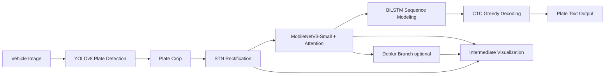

# End-to-End Chinese License Plate Recognition

> Undergraduate capstone project · A two-stage recognition system for Chinese license plates
>
> `YOLOv8 detection` + `STN + MobileNetV3 + Attention + Deblur + BiLSTM + CTC` recognition + `Tkinter` GUI
>
> 中文版 README 请见 [README.md](README.md)。

This repository implements a complete pipeline from a vehicle image to the final license-plate string, together with training scripts, training artifacts (PR / F1 / confusion matrix), a visualization GUI and a progressive training framework.

The goal is **not** to ship another industrial-grade ALPR system, but to chain detection, geometric rectification, feature extraction, an auxiliary deblur task, sequence modeling, CTC decoding, a GUI demo and the training engineering into a single, runnable system — released as an undergraduate-level end-to-end exercise.

---

## Table of Contents

- [Architecture](#architecture)
- [Highlights](#highlights)
- [Repository Layout](#repository-layout)
- [Environment](#environment)
- [Quick Start (Inference / GUI)](#quick-start-inference--gui)
- [Training](#training)
- [Artifacts and Verified Metrics](#artifacts-and-verified-metrics)
- [Implementation Notes](#implementation-notes)
- [Known Limitations](#known-limitations)
- [Roadmap](#roadmap)
- [Acknowledgements](#acknowledgements)
- [License](#license)

---

## Architecture



Every intermediate result on this chain — detection box, cropped plate, STN-rectified image, deblur reconstruction, feature maps — is rendered in the GUI, which makes the project easy to demo and debug.

---

## Highlights

- **Two-stage pipeline**: YOLOv8 for localization, a custom enhanced CRNN for character-sequence recognition.
- **Geometric rectification**: STN (Spatial Transformer Network) predicts a 2×3 affine matrix to mitigate tilt and perspective distortion.
- **Attention**: CBAM-style channel + spatial attention on the main feature map.
- **Auxiliary deblur branch**: reconstructs the original image as a side task, pushing features to stay robust on blurry inputs.
- **Lightweight backbone**: first 5 blocks of `MobileNetV3-Small` by default (one-line switch to ResNet18 supported).
- **CTC sequence recognition**: BiLSTM (hidden=256, bidirectional) + CTC — no per-character supervision needed.
- **Progressive 4-stage training**: CRNN → +STN → +deblur → joint fine-tune, to avoid the instability of enabling everything at once.
- **Training engineering**: checkpointing, `--resume`, `--stage`, `--max-train-time`, pause-via-file safe stop, TensorBoard, persisted character mapping, structured logging.
- **Data augmentation**: motion blur, random occlusion, Gaussian noise, illumination shift, raindrop simulation, light elastic deformation.
- **GUI demo**: Tkinter — load image, one-click detect-and-recognize, pop-up window with intermediate visualizations.

---

## Repository Layout

```
end-to-end/
├── README.md                # Chinese README
├── README_EN.md             # This file
├── LICENSE                  # MIT (with notes on upstream licenses)
├── requirements.txt         # Python dependencies (versions not pinned yet)
├── .gitignore
│
├── zhongduan.py             # Inference + Tkinter GUI (runnable)
├── xunlianzonghe.py         # Recognition training (4-stage progressive)
├── xunlianres2.py           # YOLOv8 detection training (incl. ONNX export)
│
├── models/                  # ★ Weights and char mapping actually loaded at inference
│   ├── best.pt              #   YOLOv8 detection weights (used by the GUI)
│   ├── best.onnx            #   YOLOv8 ONNX export (used by the GUI)
│   ├── final_model.pth      #   Recognition weights (EnhancedCRNN)
│   └── chars_mapping.json   #   Character ↔ index mapping
│
├── samples/                 # Demo images (no images bundled by default — see the README inside)
│   └── README.md
│
└── runs/
    └── detect/train/        # ★ YOLOv8 training artifacts, kept as evidence
        ├── args.yaml        #   actual training hyperparameters
        ├── results.csv      #   per-epoch loss / metrics
        ├── results.png
        ├── PR_curve.png / F1_curve.png / P_curve.png / R_curve.png
        ├── confusion_matrix.png / confusion_matrix_normalized.png
        ├── labels.jpg / labels_correlogram.jpg
        ├── train_batch*.jpg / val_batch*_pred.jpg / val_batch*_labels.jpg
        └── weights/
            ├── best.pt      #   best weights of *that* training run
            └── best.onnx    #   (a different snapshot than models/best.pt)
```

### `models/` vs. `runs/detect/train/weights/`

There are two `best.pt` files in the repo. They are **not** duplicates — they serve different purposes:

| Path | Role | Consumed by |
|---|---|---|
| `models/best.pt` / `best.onnx` / `final_model.pth` | **Inference weights actually loaded at runtime** | `zhongduan.py` GUI |
| `runs/detect/train/weights/best.pt` / `best.onnx` | **Training-evidence snapshot** — pairs with `results.csv`, the curve PNGs and the confusion matrix to form a reviewable record of one specific training run | Reviewers, not runtime |

If you only want to run the GUI, you only need the four files under `models/`; the entire `runs/` tree is safe to delete.

---

## Environment

Recommended: **Python 3.10+** and a CUDA-capable NVIDIA GPU. CPU inference works; CPU training is not practical.

```bash
python -m venv venv
# Windows
venv\Scripts\activate
# Linux / macOS
source venv/bin/activate

pip install -r requirements.txt
```

`requirements.txt` is not version-pinned. The project has been verified to run with the following combination (reference only, not enforced):

- torch 2.x + CUDA 11.8 / 12.x
- torchvision matching torch
- ultralytics ≥ 8.1
- opencv-python, Pillow, scikit-image, tqdm, tensorboard, matplotlib, numpy, pyyaml

---

## Quick Start (Inference / GUI)

Minimum requirement: the four files under `models/` are present.

```
models/
├── best.pt               # YOLOv8 detection model
├── best.onnx             # YOLOv8 ONNX (optional)
├── final_model.pth       # Recognition model (EnhancedCRNN)
└── chars_mapping.json    # Character mapping
```

Launch the GUI:

```bash
python zhongduan.py
```

In the window:

1. Click **Load Image** and pick a vehicle / plate photo (drop yours into `samples/` for convenience).
2. Click **Recognize**:
   - The left canvas shows the original image with the detection box.
   - The right canvas shows the cropped plate.
   - The recognized text appears below the canvases.
   - A matplotlib window pops up with the raw plate, STN rectification, deblur reconstruction, and feature maps.

> Only the GUI entry point is published in this repo. For batch inference / scripted invocation see [Roadmap](#roadmap).

---

## Training

> ⚠️ **Heads-up**: dataset paths and output directories in the training scripts are hard-coded to the author's local environment (`E:\CCPD2019`, `E:\BLPD`, `C:\Users\32044\Desktop\xunlianrcnn`, etc.). External users **must** edit them before running.

### 1. Datasets

This project uses two public datasets:

- **CCPD2019 / CCPD2020** — USTC's large-scale Chinese license plate dataset; labels are encoded in the filename. `parse_ccpd_filename` is provided in the training script.
- **BLPD** — a Chinese license plate dataset shipped with `train.txt` / `val.txt` files in the form `image_name plate_number`.

Datasets are **not** redistributed in this repo. Please obtain them from the original sources.

### 2. Train the YOLOv8 detector

Edit the following fields in `xunlianres2.py`:

- `dataset_path` — your local YOLO-format dataset root (must contain `data.yaml`, `train/images`, `val/images`, ...).
- `model_path` — starting weights (e.g. official `yolov8n.pt`).
- `project` / `name` — output directory.

Then:

```bash
python xunlianres2.py
```

The script trains, validates, and exports an ONNX file.

### 3. Train the recognition model (4-stage progressive)

Edit the path block at the top of `xunlianzonghe.py`:

```python
BLPD_DIR        = r"E:\BLPD"
BLPD_TRAIN_TXT  = r"E:\BLPD\train.txt"
BLPD_VAL_TXT    = r"E:\BLPD\val.txt"
CCPD_BASE_DIR   = r"E:\CCPD2019\CCPD2019"
YOLO_MODEL_PATH = r"...\YOLOv8_finetuned\...\best.pt"
OUTPUT_DIR      = r"C:\Users\32044\Desktop\xunlianrcnn"
```

Run:

```bash
# Train through all 4 stages from scratch
python xunlianzonghe.py

# Start from a specific stage
python xunlianzonghe.py --stage 3

# Resume from the most recent checkpoint
python xunlianzonghe.py --resume

# Cap total training time (minutes)
python xunlianzonghe.py --max-train-time 480

# Auto-pause at a wall-clock time every day (avoid hogging the machine)
python xunlianzonghe.py --pause-time 23:00
```

You can also drop a `pause_training.txt` file to request a safe stop at the next epoch boundary:

```bash
# Windows
type nul > pause_training.txt
```

Stages:

| Stage | Epochs | Modules enabled |
|:-:|:-:|:--|
| 1 | 15 | Base CRNN (no STN / no deblur) |
| 2 | 10 | + STN |
| 3 | 10 | + deblur auxiliary task (multi-task loss) |
| 4 | 10 | All modules, joint fine-tuning |

Outputs (written to `OUTPUT_DIR`, kept out of the repo):

- `stageX_best_model.pth` — best weights per stage
- `stageX_checkpoint_epoch_K.pth` — for resuming an interrupted run
- `chars_mapping.json` — character mapping; required at inference
- `logs/` — TensorBoard logs
- `end_to_end_lpr.log` — training log

For release, rename the final converged `.pth` to `final_model.pth` and place it (together with `chars_mapping.json`) under the repository's `models/` directory.

---

## Artifacts and Verified Metrics

A real YOLOv8 training run is checked into the repo (`runs/detect/train/`), serving as evidence of completeness:

```
runs/detect/train/
├── args.yaml                       # actual training hyperparameters (epochs=20, imgsz=640, batch=16)
├── results.csv                     # per-epoch loss / metrics / learning rate
├── results.png
├── PR_curve.png / F1_curve.png / P_curve.png / R_curve.png
├── confusion_matrix.png / confusion_matrix_normalized.png
├── labels.jpg / labels_correlogram.jpg
├── train_batch*.jpg / val_batch*_pred.jpg / val_batch*_labels.jpg
└── weights/
    ├── best.pt
    └── best.onnx
```

Final epoch (20) metrics from `results.csv`:

| Metric | Value |
|:--|:-:|
| Precision (B) | 0.9930 |
| Recall (B)    | 0.9909 |
| **mAP@0.5**       | **0.9940** |
| **mAP@0.5:0.95**  | **0.7737** |

> The recognition side (CRNN) does **not** ship a unified benchmark script in this repo, so character / sequence accuracy numbers are intentionally **not** reported here. This is tracked in [Roadmap](#roadmap).

---

## Implementation Notes

### Character set

```
PROVINCES (34) : 京 津 冀 晋 蒙 辽 吉 黑 沪 苏 浙 皖 闽 赣 鲁 豫 鄂 湘
                 粤 桂 琼 渝 川 贵 云 藏 陕 甘 青 宁 新 港 澳 台
ALPHABETS (26) : A-Z
DIGITS    (10) : 0-9
Total          : 70 classes + 1 CTC blank = 71
```

The on-disk `chars_mapping.json` is the source of truth; it is consumed at inference, never reconstructed manually.

### Tensor shapes

- Recognition input is resized to `32 × 160` (H × W), matching the Chinese blue-plate aspect ratio.
- The first 5 blocks of MobileNetV3-Small produce `[B, 40, 2, 20]`.
- Reshaped for the BiLSTM as `[B, 20, 40 × 2 = 80]`.
- BiLSTM hidden=256, bidirectional → `[B, 20, 512]` → linear classifier over 71 classes.

### Multi-task loss

- Main recognition loss: `CTCLoss` (weight fixed at 1.0).
- Auxiliary deblur loss: pixel-wise MSE against the un-augmented original image.
- Deblur weight ramps from 0.1 to 0.5 during stages 3 / 4.

### Why progressive training

Enabling STN + deblur + attention from epoch 0 lets an unconverged STN affine matrix throw CTC into divergence. Training a CRNN that already reads "straight, sharp" plates first, then adding harder sub-tasks one at a time, is much more stable in practice.

### GUI

- `tkinter` is the main framework.
- `matplotlib` pop-up shows STN / deblur / feature-map intermediates.
- Chinese rendering depends on `SimHei` (bundled with Windows; on Linux install a CJK font and update `plt.rcParams`).

---

## Known Limitations

Honest boundaries for the undergraduate open-source release:

1. **Hard-coded absolute paths** — `xunlianzonghe.py` / `xunlianres2.py` still embed `E:\` and `C:\` paths from the author's machine. Third parties must edit the source or wait for a YAML-based config refactor.
2. **No version pinning** — `requirements.txt` lists package names only; a `pip freeze` snapshot is still pending.
3. **No unified recognition benchmark** — no script reports character / sequence accuracy, so the README does not claim a recognition number.
4. **No unit or integration tests.**
5. **GUI-only inference** — no CLI batch script, no REST API.
6. **Sparse dataset onboarding** — CCPD / BLPD download and directory conventions are not fully scripted.
7. **`SimHei` font is hard-coded** in the GUI; cross-platform deployment needs adjustment.
8. **No packaging** — no Docker image, no PyInstaller bundle.
9. **Single-file scripts get long** — `zhongduan.py` ~730 LoC and `xunlianzonghe.py` ~1700 LoC bundle model definitions, data loaders, training loops and the GUI in one file each. Splitting into a proper package would help.

---

## Roadmap

- [ ] Extract `configs/*.yaml` for dataset paths, output paths, stage epochs and loss weights.
- [ ] Produce a locked `requirements-lock.txt` via `pip freeze`.
- [ ] Add `eval.py` — unified char-level / sequence-level accuracy on BLPD val + CCPD blur / weather / tilt, results captured in this README.
- [ ] Add `infer.py` — single-image / batch CLI with JSON output.
- [ ] Extract the recognition model definition from `zhongduan.py` into `models/crnn.py` so GUI / CLI / training share one source of truth.
- [ ] Ship publishable example images in `samples/` and add an end-to-end screenshot near the top of this README.
- [ ] Add an ablation table (STN on/off × Deblur on/off × Attention on/off).
- [ ] Add a FastAPI HTTP service (POST an image → detection + recognition JSON).
- [ ] Dockerfile / GitHub Actions (lint + smoke test).
- [ ] Validate multi-GPU training and AMP.
- [ ] Publish pretrained weights via GitHub Releases.

---

## Acknowledgements

This project stands on the following open-source work and datasets:

- [Ultralytics YOLOv8](https://github.com/ultralytics/ultralytics) — detection backbone
- [CCPD: Chinese City Parking Dataset](https://github.com/detectRecog/CCPD) — primary training / evaluation data
- BLPD — Chinese license plate dataset
- MobileNetV3 (Howard et al., 2019)
- STN: Spatial Transformer Networks (Jaderberg et al., 2015)
- CRNN (Shi et al., 2017) + CTC (Graves et al., 2006)
- CBAM (Woo et al., 2018) — attention design

If this repository helps your study or paper, citations or a heads-up via Issues are very welcome.

---

## License

The project's own code is released under the [MIT License](LICENSE).

**Upstream third-party licenses also apply**, and using this project does not waive them:

- **Ultralytics YOLOv8** is released under **AGPL-3.0**. The weights produced from YOLOv8 (`models/best.pt`, `models/best.onnx`, `runs/detect/train/weights/*`) and any code in `xunlianres2.py` that calls the Ultralytics API are governed by AGPL-3.0. Commercial deployments must obtain a separate commercial license from Ultralytics.
- **CCPD2019 / CCPD2020 and BLPD** datasets remain under the licenses of their original publishers; no dataset image is redistributed here.
- MobileNetV3, STN, CRNN, CBAM follow the citation / license terms in their original papers and repositories.

See [LICENSE](LICENSE) in the repository root for the full text.

---

## Notes

- This project is **not** an industrial ALPR solution. Do not deploy it for security, traffic enforcement, or other production scenarios.
- A real YOLOv8 training run (curves, confusion matrix, `results.csv`, weights) is kept inside the repo so third parties can inspect the experiment without retraining.
- Issues and pull requests are welcome — especially around the open items in [Roadmap](#roadmap).
